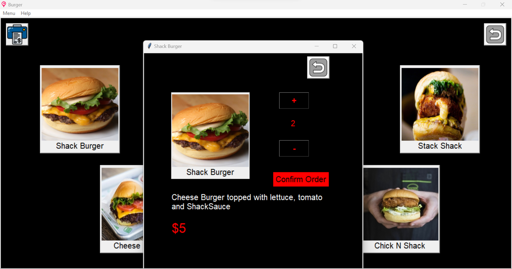

# AI BASED FOOD ORDERING SYSTEM

## About the Project

This project is about ordering food from a Cafe. Individual order can be taken from respective tables. A bill is generated once u give the order. GUI made using Python Tkinter. You are free to to use this project for college or school purposes. Please note that this project is not made for business or commercial purposes.

    <b>Home Page</b>

    <b>Menu Page</b>

    <b>Recommendation Page</b>

    <b>Sub Menu Page</b>

    <b>Enter Detail Page</b>

    <b>Billing and Estimated Time Page</b>

    <b>About Us Page</b>

## How to Run

Run the `main file` python file. DB already created.

## Admin Page

To access admin portal:
In the application window, go to `File` then `Admin`.

Admin credentials: 
Username: admin Password: admin123

## Technologies Used

PYTHON

TKINTER
