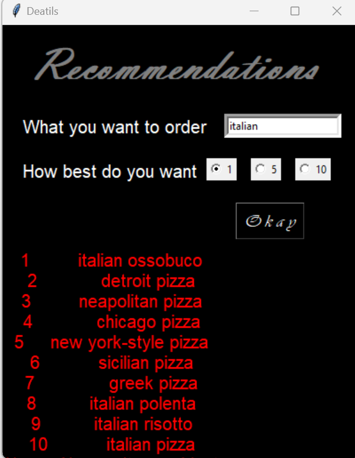

# AI BASED FOOD ORDERING SYSTEM

## About the Project

AI based food ordering system is about ordering food from a Cafe. GUI made using Python Tkinter. The system integrated voice recognition technology for easeful ordering, a recommendation system for personalized menu suggestions, and an estimated delivery time feature.

## How to Run

Run the `main file` python file. DB already created.

## Admin Page

- To access admin portal:
In the application window, go to `File` then `Admin`.

- Admin credentials: 
Username: admin Password: admin123

## Technologies Used

- PYTHON
- TKINTER

## Screenshots

    <b>Home Page</b>

    <b>Menu Page</b>

    <b>Recommendation Page</b>

  

    <b>Sub Menu Page</b>

    <b>Enter Detail Page</b>

    <b>Billing and Estimated Time Page</b>

